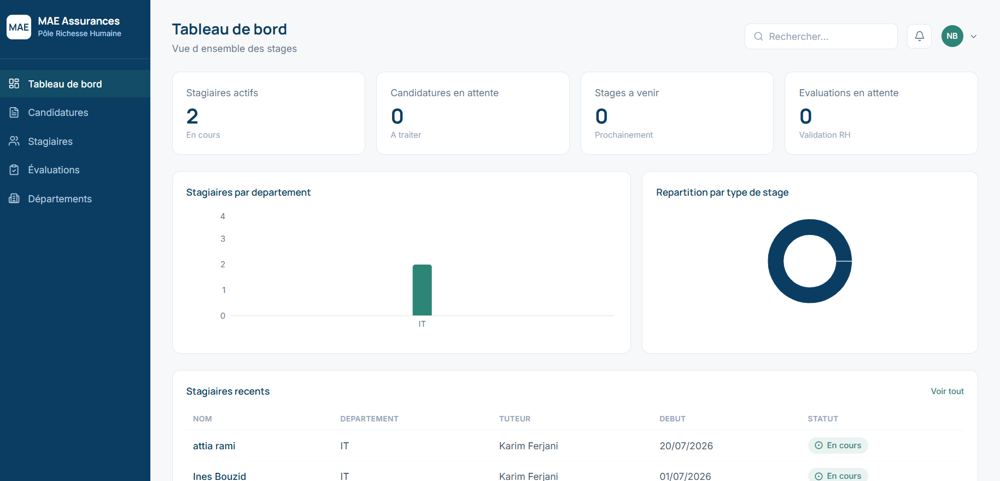
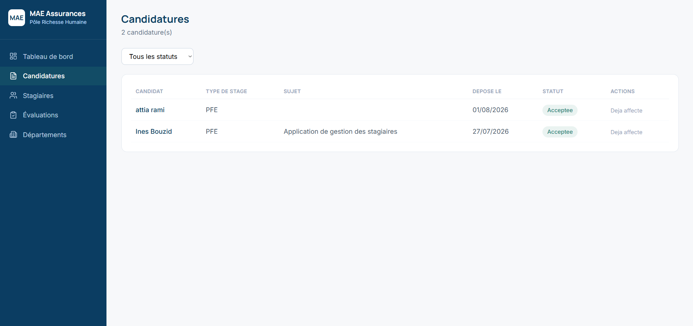
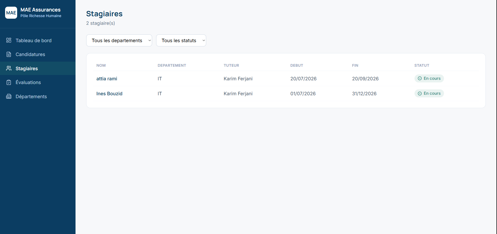
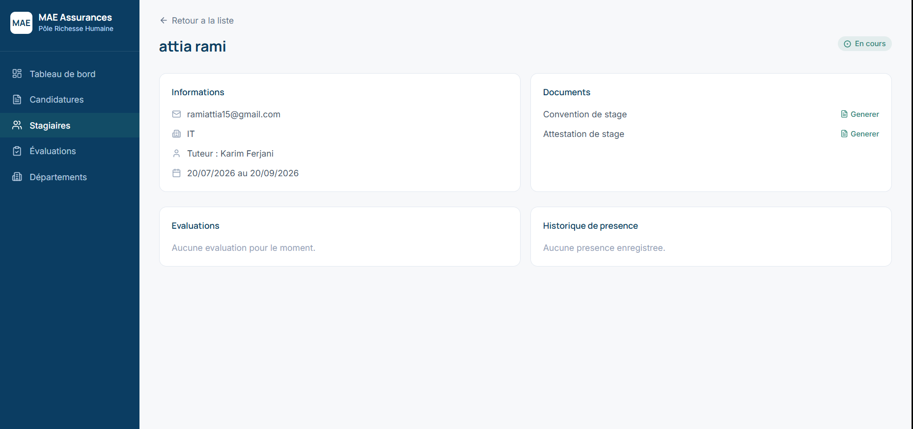
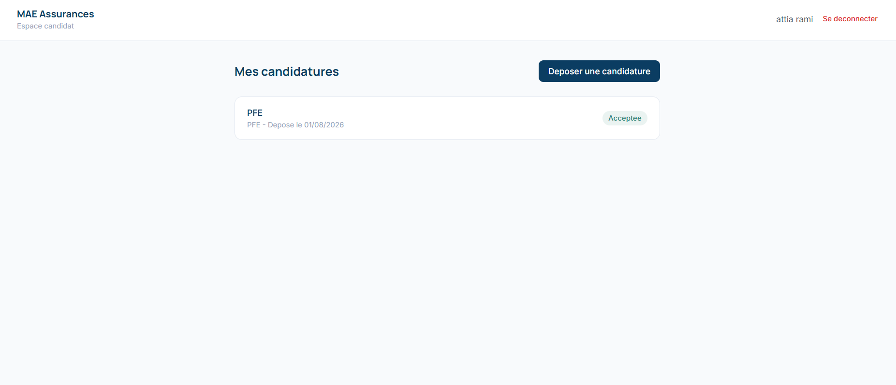

# MAE Stagiaires - Gestion des stagiaires du Pole Richesse Humaine

Application web developpee pour digitaliser et centraliser la gestion des stagiaires du Pole Richesse Humaine de **MAE Assurances** (Tunisie) : candidatures, affectations, documents, presence et evaluations, avec un tableau de bord de suivi.

> Projet realise dans le cadre d un stage - conception (UML, modele de donnees, architecture) puis developpement full-stack.

## Apercu

### Tableau de bord


### Gestion des candidatures


### Liste des stagiaires


### Fiche stagiaire (avec generation de documents)


### Espace candidat


## Fonctionnalites

**Gestion des candidatures**
- Depot de candidature depuis un espace candidat dedie (inscription, connexion, suivi)
- Suivi du statut (deposee -> en cours detude -> acceptee / refusee)
- Traitement par le RH avec affectation departement/tuteur

**Gestion des stagiaires**
- Creation du dossier stagiaire, affectation au departement et au tuteur
- Statut calcule dynamiquement (a venir / en cours / termine) selon les dates
- Fiche detaillee avec informations, evaluations et historique de presence

**Gestion documentaire**
- Generation de convention et d attestation de stage au format PDF
- Telechargement direct depuis la fiche stagiaire

**Evaluation**
- File d attente de validation cote RH (valider / renvoyer pour revision)
- Historique des evaluations par stagiaire
- Formulaire de saisie cote tuteur (espace tuteur dedie)

**Tableau de bord**
- Nombre de stagiaires par departement, repartition par type de stage
- Stagiaires actifs, candidatures en attente, evaluations a valider

## Stack technique

| Couche | Technologie |
|---|---|
| Frontend | React 18, Vite, Tailwind CSS, React Router, Recharts |
| Backend | Node.js, Express, Zod (validation) |
| Base de donnees | SQLite (dev) via Prisma ORM |
| Authentification | JWT, bcrypt |
| Generation PDF | pdfkit |

## Architecture


Le dossier [`docs/conception.md`](docs/conception.md) detaille la conception complete : diagramme de cas d utilisation, diagramme de classes, modele logique de donnees et diagramme de sequence.

## Structure du projet
## Installation et lancement

### Prerequis
- Node.js >= 18

### Backend

```bash
cd backend
npm install
cp .env.example .env
npx prisma migrate dev --name init
node prisma/seed.js
node src/server.js
```
L API demarre sur `http://localhost:4000`. Compte RH de demonstration : `rh@mae.tn` / `motdepasse123`.

### Frontend

```bash
cd frontend
npm install
npm run dev
```
L application est disponible sur `http://localhost:5173`.

## Modele de donnees

Le schema complet est defini dans [`backend/prisma/schema.prisma`](backend/prisma/schema.prisma) : `Utilisateur`, `Candidature`, `PieceJointe`, `Departement`, `Stagiaire`, `Presence`, `DocumentGenere`, `Evaluation`.

## Roles applicatifs

| Role | Permissions |
|---|---|
| Candidat | Cree un compte, depose une candidature, suit son statut |
| Tuteur | Suit la presence de son stagiaire *(saisie d evaluation a venir)* |
| Responsable RH | Traite les candidatures, affecte les stagiaires, genere les documents, valide les evaluations, consulte le tableau de bord |
| Administrateur | Gere les comptes et les departements |

## Feuille de route

- [ ] Formulaire de saisie d evaluation cote tuteur
- [ ] Notifications par email lors des changements de statut
- [ ] Gestion des pieces jointes (CV, lettre de motivation) a l upload
- [ ] Export des statistiques du tableau de bord (CSV/Excel)
- [ ] Deploiement en ligne (demo publique)

## Licence

Distribue sous licence MIT - voir [`LICENSE`](LICENSE).


